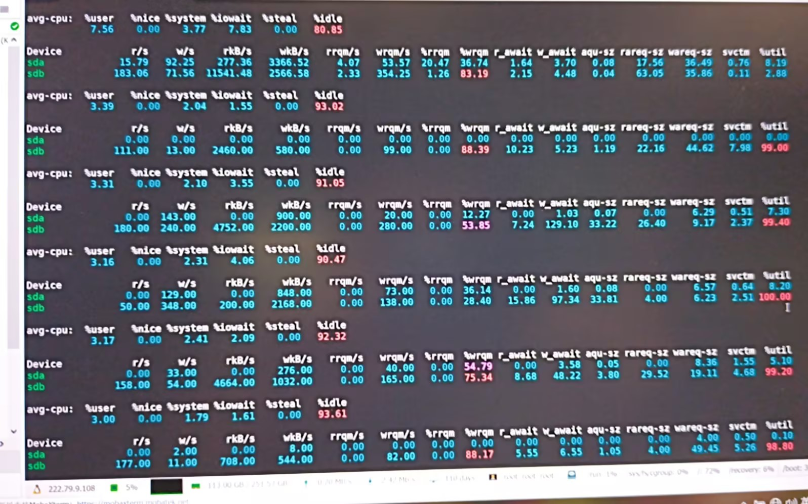

# 03｜慢系统与性能排查｜IO高、磁盘慢时，iostat 重点看哪几个指标？

当你已经感觉系统“不是 CPU 忙，而是哪里在等”的时候，`iostat` 往往就是下一步最关键的命令。

它最适合回答这几个问题：

- CPU 是不是真的在等磁盘
- 磁盘设备是不是已经接近打满
- 是读慢、写慢，还是整体 IO 在排队

如果只想先记 3 条：

- 线上优先看 `iostat -y -x 1 3`
- 先盯 `%iowait`、`%util`、`await`
- `w_await` 高就多看写入路径，`r_await` 高就多看读取路径

## 一、什么情况下应该立即看 `iostat`

`iostat` 用于查看 CPU 与块设备 IO 统计，是定位磁盘瓶颈最常用的 Linux 命令之一。

它通常出现在这些场景里：

- `top` 里 `wa` 明显偏高
- CPU 不高，但系统仍然很慢
- 进程列表里出现持续的 `D` 状态
- 负载高，但热点 CPU 进程并不明显

一句话记住：

**只要你开始怀疑“机器是在等 IO”，就该切到 `iostat`。**

## 二、先记住这几个高频命令

最常用的是这几条：

```bash
iostat -y -x 1 3
iostat -d -x 1 5
iostat -p sda -x 1
iostat -x 1 10 > iostat.log
```

它们分别适合：

- `iostat -y -x 1 3`：排查首选，忽略首屏累计值，连续看 3 轮
- `iostat -d -x 1 5`：只盯设备层，少看 CPU 区域
- `iostat -p sda -x 1`：专看某块盘及其分区
- `iostat -x 1 10 > iostat.log`：留证、比对、回放

如果只记一个，就记：

```bash
iostat -y -x 1 3
```

## 三、排查时优先看哪 4 个指标



这张图最值得对照看的不是全部字段，而是下面会反复提到的 `%iowait`、`%util`、`await`、`r_await`、`w_await`。

`iostat -x` 的输出里，最先看的通常不是全部字段，而是下面这 4 个：

### 1. `%iowait`

它表示 CPU 有多少时间在等 IO。

经验判断：

- `%iowait > 10%` 且持续：已经要重点关注
- `%iowait` 高、`%idle` 也不低：很像 CPU 在“等磁盘”

### 2. `%util`

它表示设备有多忙。

经验判断：

- `< 50%`：通常还比较轻松
- `50% ~ 80%`：已有压力
- `> 80%`：明显紧张
- 接近 `100%`：设备非常容易成为瓶颈

### 3. `await`

它表示一次 IO 从发出到完成的平均等待时间。

`await` 高，通常意味着：

- 请求在排队
- 存储响应变慢
- 单次 IO 变得很重

### 4. `r_await` 和 `w_await`

这两个值很适合判断问题偏读还是偏写。

- `r_await` 明显更高：多看读取链路
- `w_await` 明显更高：多看写入链路

数据库落盘、日志刷盘、批量写文件这类问题，经常会先在 `w_await` 上暴露出来。

## 四、看到这些组合时通常意味着什么

### 1. `%util` 很高，`await` 也很高

这通常说明设备已经很忙，而且请求也开始明显排队。

常见含义：

- 磁盘接近打满
- 进程都在排队等 IO
- 系统“慢”的根源更像存储侧，而不是 CPU

### 2. `%util` 不算很高，但 `await` 还是很高

这类情况最容易误判。

它可能意味着：

- 单次 IO 很大
- 后端是网络存储或 RAID
- 存储设备本身在抖动

所以不要把“`%util` 没到 100%”直接理解成“磁盘没问题”。

### 3. `%iowait` 高，但 `%idle` 也高

这是一类非常典型的现场信号：

- CPU 没有忙着算
- 但系统也没有真正空闲
- 本质上是 CPU 在等 IO

如果同时还能看到 `D` 状态进程，基本就可以继续往 IO 方向收敛了。

### 4. `w_await` 明显高于 `r_await`

这类场景常见于：

- 日志刷盘过于频繁
- 数据库 checkpoint 或 flush
- 批量写文件、导出任务叠加

这时优先查写入链路，比先查读取链路更有效。

### 5. `r/s`、`w/s` 很高，同时 `await` 也很高

这通常说明不是“单个请求偶尔慢”，而是“高并发下已经开始堆积”。

这时系统慢往往会伴随：

- 接口超时增多
- 命令执行发卡
- 进程出现等待或 `D` 状态

## 五、输出结构怎么快速读

### 1. `avg-cpu` 区域

这个区域最常看的是：

- `%user`
- `%system`
- `%iowait`
- `%idle`

够用的读法是：

- `%iowait` 高：CPU 在等 IO
- `%system` 高：系统调用或 IO 压力可能较大
- `%idle` 仍然不低：说明机器不是纯 CPU 饱和

### 2. `Device` 区域

设备区最值得盯的是：

- `r/s`、`w/s`
- `rkB/s`、`wkB/s`
- `await`
- `r_await`、`w_await`
- `%util`

你可以直接这样记：

- `r/s`、`w/s`：请求量大不大
- `await`：等得久不久
- `%util`：设备忙不忙

## 六、最常见的误区

### 1. 只看 `%util`，不看 `await`

`%util` 不是唯一指标。

有些场景下，`%util` 没有特别夸张，但 `await` 已经明显偏高，实际性能问题依然很重。

### 2. 只看一轮输出就下结论

`iostat` 更适合连续看几轮，而不是盯住单次瞬时值。

所以排查首选 `1 3` 或 `1 5` 这类连续采样。

### 3. 看到 `%iowait` 高，就只盯磁盘硬件

IO 问题不一定都是物理盘坏了，也可能是：

- 应用写入放大
- 日志刷盘过多
- 网络存储抖动
- 后端阵列或云盘延迟升高

## 七、结论

`iostat` 最重要的价值，是把“系统慢”从模糊感受，落成可以判断的几组指标。

先看 `%iowait`、`%util`、`await` 和 `r_await/w_await`，通常就已经足够判断：机器到底是不是被 IO 拖慢了，以及问题更偏读还是偏写。
