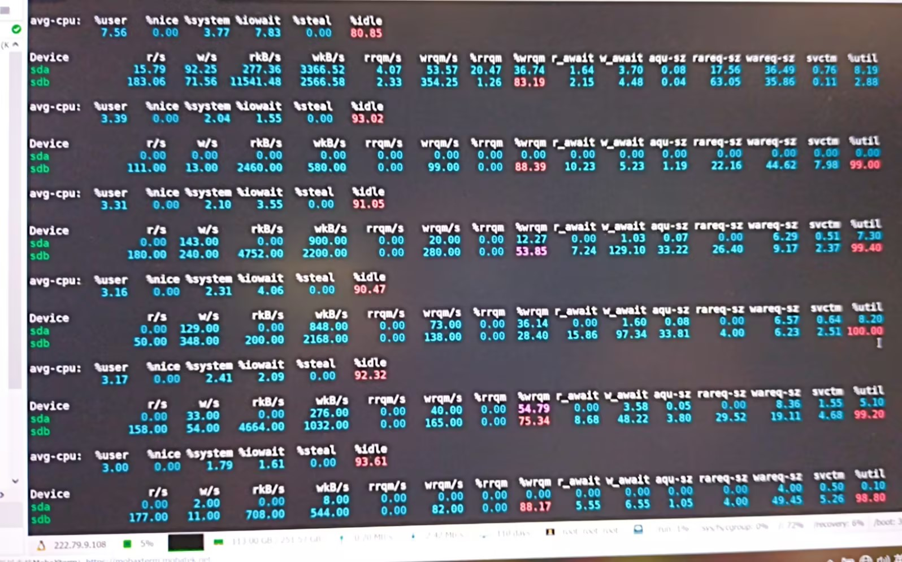

# iostat命令详解

## 1. 命令简介
`iostat` 用于查看 CPU 与块设备（磁盘）IO 统计，是定位磁盘瓶颈最常用的 Linux 命令之一。

说明：
- `iostat` 来自 `sysstat` 工具包。
- 建议优先使用 `iostat -x` 查看扩展指标。

## 2. 基本用法
```bash
iostat
```

常用启动参数：
- `iostat -x`：显示扩展磁盘指标（重点）
- `iostat -x 1`：每 1 秒刷新一次
- `iostat -x 1 3`：每 1 秒刷新，输出 3 次
- `iostat -d -x`：只看设备统计
- `iostat -p sda -x 1`：只看指定磁盘（含分区）
- `iostat -y -x 1 3`：忽略启动以来的首屏累计值

## 3. 输出结构



`iostat -x` 通常分为两部分：
- `avg-cpu`：CPU 维度统计
- `Device`：磁盘设备维度统计

### 3.1 avg-cpu 区域
常见字段：
- `%user`：用户态 CPU
- `%system`：内核态 CPU
- `%iowait`：IO 等待
- `%idle`：空闲 CPU

关注建议：
- `%iowait > 10%`：需要重点关注 IO 瓶颈。
- `%iowait` 高且 `%idle` 也高：常见于 CPU 在“等磁盘”。
- `%system` 持续偏高：需要关注系统调用/IO 压力。

### 3.2 Device 区域
常见字段：
- `r/s`、`w/s`：每秒读写请求数
- `rkB/s`、`wkB/s`：每秒读写吞吐量
- `await`：一次 IO 的平均等待时间（ms）
- `r_await`、`w_await`：读写各自等待时间（ms）
- `%util`：**磁盘繁忙程度，磁盘是否被打满（第一指标）**
- `svctm`：平均服务时间（部分系统中可能不提供）

关注建议：

| 字段              | 含义                                                | 判断                                                         |
| ----------------- | --------------------------------------------------- | ------------------------------------------------------------ |
| %util             | 磁盘繁忙程度，磁盘是否被打满（第一指标）            | < 50% 很空闲，50%～80%有压力，\> 80%明显瓶颈，≈100%**磁盘打满（必慢）** |
| await             | IO 总等待时间，一次 IO 从发出到完成的平均时间（ms） | 正常范围SSD硬盘 < 5～10 ms，HDD硬盘<< 20～50 ms， **await 高 = IO 慢** |
| r_await / w_await | 读写等待时间                                        | 判断是 **读慢** 还是 **写慢**，数据库 / 日志场景非常有用     |
| r/s、w/s          | IO 次数，每秒读 / 写请求数                          | r/s、w/s 高 + await 高 = **IO 请求堆积**                     |

### 3.3 典型场景

**场景 1：%util 100%，await 高**

 磁盘已满载，所有进程排队

**场景 2：%util 不高，但 await 高**

可能是：

- 单次 IO 很大
- RAID / 网络存储
- 磁盘抖动

**场景 3：%iowait 高，CPU 很闲**

CPU 在等磁盘

**场景 4：写 await 明显高于读**

常见于：

- 日志刷盘
- 数据库 checkpoint
- fsync 频繁

## 3.3 参数关注速查表

| 参数 | 需要关注的情况 | 可能方向 |
| --- | --- | --- |
| `%iowait` | `> 10%` 且持续 | IO 等待明显 |
| `%util` | `> 80%` 持续 | 设备压力较高 |
| `%util` | `≈ 100%` | 设备接近打满 |
| `await` | 持续升高 | IO 排队/存储变慢 |
| `r_await` | 明显高于 `w_await` | 读路径瓶颈 |
| `w_await` | 明显高于 `r_await` | 写路径瓶颈 |
| `r/s,w/s` + `await` | 同时较高 | 高并发下 IO 堆积 |

## 4. 实用示例

每秒采样一次，连续看 3 次：
```bash
iostat -x 1 3
```

仅查看磁盘指标，适合聚焦设备层：
```bash
iostat -d -x 1 5
```

忽略首屏累计值，避免历史数据干扰：
```bash
iostat -y -x 1 10
```

将结果保存到日志文件：
```bash
iostat -x 1 60 > iostat.log
```

## 5. 使用建议
- 排查性能问题时，优先用 `iostat -y -x 1 3` 看实时状态。
- 重点先看 `%iowait`、`%util`、`await` 三个指标，再看读写细分。
- 观察时至少连续看几轮，避免被单次抖动误导。
