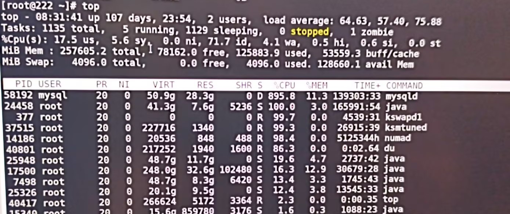
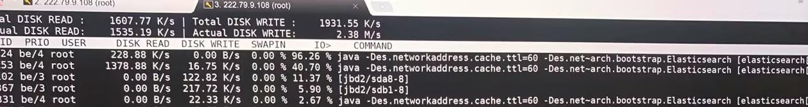

# 一次IO瓶颈导致系统缓慢排查记录

## 背景
某次现场反馈“系统整体变慢、接口响应明显延迟”，但业务进程未出现大面积报错。为了快速止损，我们按执行了标准化排查流程，并最终确认是磁盘 IO 瓶颈导致的系统缓慢。

## 故障现象
- 用户侧感知：页面加载慢、接口超时增多。
- 主机侧初看：CPU 使用率不高，但系统响应迟钝。
- 初步判断：更像“资源等待”而不是“CPU 算力不足”。

## 排查过程

### 1. 先看 `top -c`：CPU 不高，但 `wa` 偏高
重点关注 CPU 行中的 `wa`（IO wait）。



- `us` 不高：不是纯计算型瓶颈。
- `id` 仍有空闲：CPU 并未打满。
- `wa` 超过 10%：出现明显 IO 等待信号。

这一步给出第一个结论：系统慢不是“CPU不够”，而是“CPU在等IO”，图中`wa`信号不是很明显，继续下一步。

### 2. 看进程状态：出现 `D` 态进程
在 `top -c` 进程列表里关注 `S` 列，发现存在 `D`（不可中断 IO 等待）状态进程。

这说明至少有一批线程卡在磁盘/存储等待上，进一步坐实 IO 方向。

### 3. 用 `iostat -x 1 3` 做磁盘级确认
执行命令：

```bash
iostat -x 1 3
```


现场关键指标如下：

```text
avg-cpu:  %user  %nice %system %iowait  %steal %idle
           6.12    0.00    2.31    18.45    0.00   73.12

Device            r/s   w/s   rkB/s   wkB/s  rrqm/s wrqm/s await  r_await  w_await  svctm  %util
sda              120.3  85.6   5200    3400     2.1   1.3  45.6     38.2     56.4     3.2   98.7
```

解读：
- `%iowait=18.45%`：远高于 10%，CPU 大量时间在等待 IO。
- `%util=98.7%`：磁盘几乎打满，设备繁忙度接近极限。
- `await=45.6ms`：单次 IO 等待明显偏高。
- `w_await > r_await`：写路径比读路径更慢，写入压力更突出。

到这里，证据链已经完整：系统慢的主因是磁盘 IO 瓶颈。

### 4. 用 `iotop -o -d 1` 找“罪魁祸首进程”
执行命令：

```bash
iotop -o -d 1
```



只观察有 IO 行为的进程（`-o`），定位到高 IO% 的业务进程，且写入占比明显偏高。结合业务行为，最终锁定为高频日志刷盘叠加突发写入导致。

## 根因结论
- 直接原因：磁盘繁忙度长期接近 100%，IO 请求排队，进程出现 `D` 态等待。
- 触发条件：高并发时段出现持续写入放大（日志/落盘操作密集）。
- 结果表现：CPU 看似不高，但整体吞吐下降、响应时间上升。

## 处理动作

### 紧急止损
- 降低非关键日志级别，减少同步刷盘频率。
- 将部分批量写改为异步/批处理，降低写放大。
- 避开高峰时段执行重 IO 后台任务。

### 长期优化
- 日志与数据盘分离，避免业务读写与日志争抢同一块盘。
- 建立 IO 基线告警：`%iowait`、`%util`、`await`、`D` 态进程数。
- 对核心写路径做限流与削峰，避免瞬时突刺把磁盘打满。

## 结果回看
优化后现场观察到：
- `%iowait` 明显回落；
- `await` 降低，`%util` 不再长期高位；
- 接口响应恢复，超时率下降。

## 复盘沉淀：可复用的慢系统排查顺序
1. `top -c`：先判断是 CPU 忙还是 IO 等待。
2. 看进程状态：是否存在 `D` 态。
3. `iostat -x 1 3`：用 `%iowait/%util/await` 定位磁盘瓶颈。
4. `iotop -o -d 1`：落到具体进程，关联业务动作。
5. 先止损再优化：先把系统拉回可用，再做架构级治理。

---
这次故障再次说明：系统“慢”不等于 CPU“高”。当 CPU 不高但服务变慢时，优先检查 IO 等待，往往能更快命中根因。
