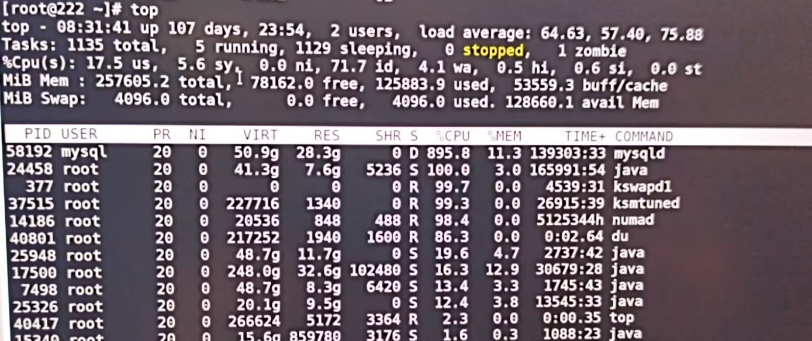

# 慢系统与性能排查02：Linux系统变慢时，为什么第一步先看 top？

系统一变慢，很多人的第一反应是“哪个进程 CPU 高”。但线上更常见的情况是，CPU 看起来不高，机器却明显发卡，接口也开始变慢。

`top` 的价值就在这里。它不是只告诉你“CPU 高不高”，而是先帮你判断：

- 机器到底是在忙，还是在等
- 问题更像 CPU、内存，还是 IO
- 下一步应该继续查 `ps`、`iostat`，还是直接盯具体进程

如果只想先记 3 条：

- 排查时优先执行 `top -c`，先看完整命令行
- `wa` 持续偏高、`D` 状态进程持续出现时，先怀疑 IO，不要只盯 CPU
- `top` 负责做第一轮全局判断，后续再用 `ps` 和 `iostat` 往下收敛

## 一、什么情况下第一时间看 `top`

只要你还没判断清楚“机器为什么慢”，`top` 基本都应该是第一步。

它特别适合这些场景：

- 系统整体变慢，但还不知道问题落在 CPU、内存还是 IO
- 负载突然升高，想先看是不是热点进程把机器打满了
- 服务响应变慢，想快速确认有没有异常状态进程
- SSH 还能登录，但命令执行明显变慢，想先判断机器是在忙还是在等

`top` 最适合回答的不是“根因是什么”，而是“下一步该往哪条路查”。

## 二、打开 `top` 后先看哪 5 个位置

先执行：

```bash
top -c
```

`-c` 的价值很高，因为它能直接显示完整命令行。线上排查时，看到完整命令通常比只看到一个进程名更有用。



上图更适合配合下面这 5 个观察点一起看，不建议只盯单个热点进程。

### 1. 先看 `load average`

第一行里的 `load average` 表示 1 分钟、5 分钟、15 分钟平均负载。

快速判断：

- `1m` 持续大于 CPU 核数：系统有过载风险
- `1m > 5m > 15m`：压力正在上升
- `1m < 5m < 15m`：系统可能在从一波高峰中恢复

这里最容易误判的一点是：

**负载高不等于 CPU 一定高。**

如果进程在等磁盘、等锁、等存储，负载一样会很高。

### 2. 再看 CPU 行里的 `us`、`sy`、`id`、`wa`、`st`

第三行最值得先盯的是这几个字段：

- `us`：用户态 CPU
- `sy`：内核态 CPU
- `id`：空闲 CPU
- `wa`：IO 等待
- `st`：虚拟机被宿主机“偷走”的 CPU

一个很好用的经验判断是：

- `id < 20%` 且持续：CPU 资源紧张
- `wa > 10%` 且持续：优先怀疑 IO 瓶颈
- `sy` 持续偏高：可能有系统调用、内核开销或 IO 压力
- `st > 5%`：虚拟化环境里可能存在 CPU 争抢

如果 CPU 不高，但 `wa` 高，说明机器不是“忙着算”，而是“忙着等”。

### 3. 看 `Tasks` 和进程状态

第二行里最值得注意的不是进程总数，而是有没有异常状态持续出现。

重点看这些状态：

- `R`：运行中
- `S`：休眠
- `D`：不可中断等待
- `Z`：僵尸进程

排查里最关键的是 `D`：

- 偶尔出现一次，不一定有问题
- 持续出现、而且数量不止一个时，优先往 IO 或存储侧排查

`Z` 持续累积，则更像父进程回收逻辑出了问题。

### 4. 看内存和 `Swap`

很多人一看到 `free` 很低就紧张，其实这经常是正常现象。

Linux 会把空闲内存用来做缓存，所以更值得看的是：

- `buff/cache` 是否很高
- `Swap` 是否开始持续增长
- 系统变慢时是否同时出现明显 swap 活动

快速判断：

- `free` 低但 `buff/cache` 高：通常不算异常
- `Swap used` 持续增长：需要关注内存压力
- 系统慢且 swap 活跃：优先排查大内存进程

### 5. 最后看进程列表

进程列表里优先盯这几列：

- `%CPU`
- `%MEM`
- `S`
- `TIME+`
- `COMMAND`

常见读法：

- 某个进程长期高 `%CPU`：先怀疑热点计算或异常循环
- 某个进程 `%MEM` 持续上涨：关注内存泄漏或缓存失控
- 某个进程长期处于 `D` 状态：优先排查 IO 等待链路

如果看到的是进程名，不是完整命令，按一次 `c` 切换。

## 三、先记住这几个高频用法

如果只想记最常用的几条，先记这组：

```bash
top -c
top -d 2
top -n 5
top -p 1234 -c
top -u root
top -b -n 1
```

它们分别适合：

- `top -c`：排查首选，直接看完整命令行
- `top -d 2`：放慢刷新频率，便于观察
- `top -n 5`：看固定几轮后退出
- `top -p 1234 -c`：只盯一个进程
- `top -u root`：只看指定用户的进程
- `top -b -n 1`：批处理输出，适合脚本和留证

## 四、排查里最常见的 4 种读法

### 1. `id` 很低，热点进程 CPU 很高

这通常是机器真的在忙着算。

下一步优先做：

- 按 `%CPU` 排序确认热点进程
- 判断是正常高峰还是异常循环
- 再用 `ps` 补充父子进程和命令行信息

### 2. CPU 不高，但 `wa` 很高

这是线上最容易误判的一类。

常见组合是：

- `id` 还有空闲
- `wa` 持续升高
- 机器整体响应变慢

这时不要继续只盯 CPU，应该立刻切到：

```bash
iostat -y -x 1 3
```

### 3. `Swap` 活跃，响应变慢

如果你看到：

- `Swap used` 持续增长
- 某些进程 `%MEM` 偏高
- 机器不一定高 CPU，但执行命令明显变慢

那更像是系统在拿性能换空间。

下一步先用：

```bash
ps aux --sort=-%mem | head -10
```

### 4. `D` 状态进程持续出现

`D` 状态不是普通“休眠”，而是不可中断等待。

如果它持续存在，尤其是和 `wa` 偏高一起出现，排查方向基本就比较明确了：

- 磁盘 IO
- 存储链路
- 大量同步落盘
- 下游存储抖动

## 五、运行中的高频交互按键

排查时最常用的是这几个：

- `c`：切换进程名和完整命令行
- `P`：按 `%CPU` 排序
- `M`：按 `%MEM` 排序
- `T`：按 `TIME+` 排序
- `1`：展开每个 CPU 核心使用率
- `u`：过滤指定用户
- `k`：结束进程
- `r`：调整 nice 值
- `q`：退出

如果只是排查，不建议一上来就 `k` 杀进程，先把证据收集完整。

## 六、最常见的误区

### 1. 只看 CPU 百分比，不看 `wa`

CPU 不高不代表系统没问题，它也可能是在等磁盘、等存储、等锁。

### 2. 看到 `free` 很低就断定内存不够

Linux 会积极使用缓存，所以更该看的是 `Swap` 是否活跃，以及大内存进程是否明显上升。

### 3. 只看一眼就下结论

`top` 是动态工具，至少连续看几轮，才能区分是瞬时抖动还是持续瓶颈。

## 七、结论

`top` 最重要的价值，不是把每一列都看懂，而是先帮你判断下一步该往哪边查。

先用 `top -c` 做全局判断，再根据 `wa`、`Swap`、`D` 状态和热点进程，决定是否转到 `ps` 或 `iostat`，这条路会比一上来就猜根因稳得多。

